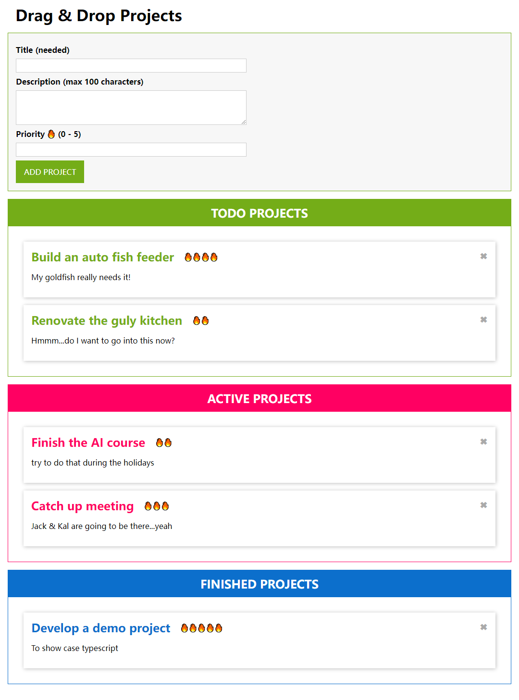

# Who is it for

* Those who are interested to see how **Typescript + Webpack** works. 
* Those who want to see a demo of how **HTML5 drag & drop** works.

# About The Project

This project uses Typescript to build a small demo that showcase the use of interface & class, generics, decorators, and HTML5 drag and drop features. Everything is developed under the OOP, functional programming, and modulised fashion.

From bottom up, this project will demonstrate how to initialise a project and construct the file structure. Look into `package.json` to see what packages are included. Look into `tsconfig.json` to see how Typescript parameters are configured. Finally, look into `webpack.config.js` and `webpack.config.prod.js` to see how Webpack is channeling everything together and publish them into the `./public` folder, such as the bundle file with contenthash, static html, and image assets differently in `development` mode and `production` mode.

This project contains pure front-end code only. It can be easily extended with and database package like Firestore, with a bit of modifications in the `state` classes, and an init load function for each of the classes in `view` folder. If you are implementing a server side for it, it is strongly recommended that the server connection keys are stored in the `.env` file. The `Dotenv` package is already in place.

It is also recommended that the `.env` file should be excluded from git by putting it into `.gitignore` along with the `node_modules` folder.

# How to Use the Demo
Download this project to a folder on the computer, and type `npm install` from the terminal. Once the packages are ready, type `npm run start` and a website is served at `localhost:8080`.

The demo comes with some data already. Just click the "Add Project" button a few times from the input box to populate these rows to get a list to play with. User can drag-and-drop these rows into different stages:

> ADD ROW : TODO > ACITVE > FINISHED

User can re-order a row by dragging it before or after any other rows.

> INSERT ROW : BEFORE | AFTER

User can also click the "X" delete button to delete any existing rows. Validation and Confirmation mechanism will happen upon input and delete.

> DELETE ROW : CONFIRM

# Here is a Picture of the Demo

# Copyrights & Liabilities
A couple of fair dealing rules. Anyone can use the code and any materials provided in this project freely for study or work purposes without seeking the permission of the author. However, if you use a "fair amount" of this project as a codebase of your assignment or work project, you must give credit to the author by including the author's name and a hyper link to this github location in your work. The author reserves all rights to ask anyone to take back the code upon any conflict of interest. The code is provided as is without any bug-free promise, and the author is not responsible for any damage caused by it if a loss has happened.